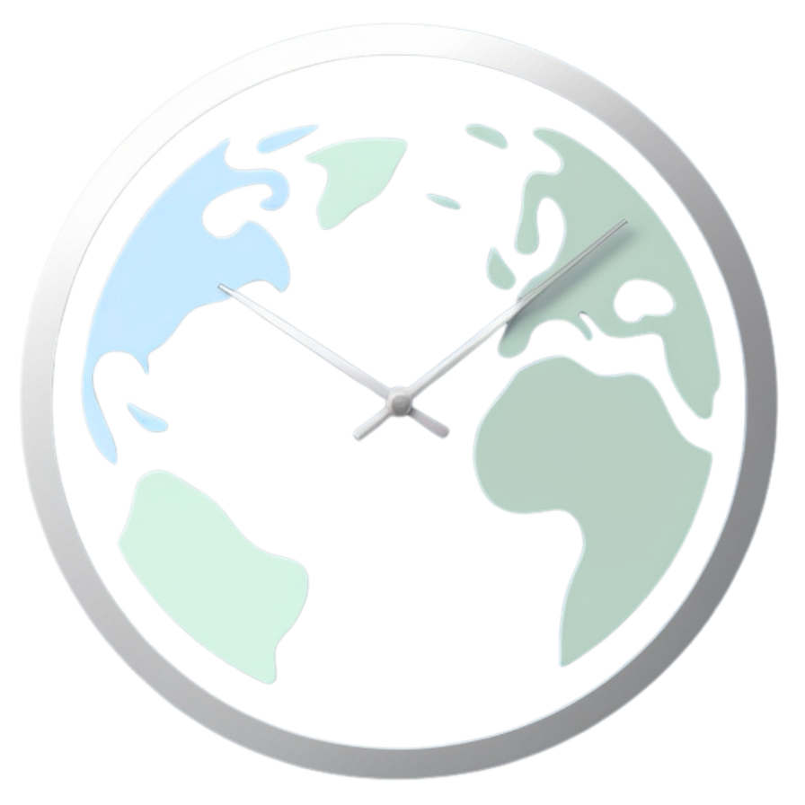
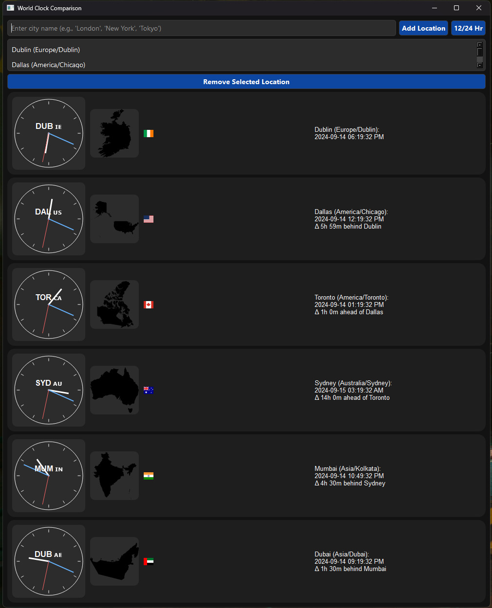

#  World Clock Comparison 


A graphical application to compare the current time in different cities around the world, built with Python and PyQt6.



## Features

- Add and remove cities from the list
- Automatically detect the timezone of each city
- Display the current time and weather in each city, including the timezone offset from the previous city
- Show the time difference between cities
- Toggle between 12-hour and 24-hour time formats
- Graphical clock face for each city
- Country shape display for each location
- Flag emoji for each country
- Weather forecast for each location (on left-click)
- Remove loction from the list (on right-click)
- Weather forcast appears in seperate window, showing forcast in 3 hour increments showing weather condition, temperature, humidity, wind speed, wind direction, and percipitation chance, percipitation amount

## Requirements

- Python 3.x
- PyQt6
- pytz
- geopy
- timezonefinder
- requests
- matplotlib
- pycountry
- geopandas

## Installation

1. Clone the repository:
   ```
   git clone https://github.com/Aatman1/pyClockZone.git
   ```
2. Install the required packages:
   ```
   pip install -r requirements.txt
   ```
3. Run the application:
   ```
   python clocks.py
   ```

## Usage

1. Enter a city name in the input field and click "Add Location" or press Enter to add it to the list.
2. Right-click on a location or select it and press Delete to remove it from the list.
3. Left-click on a location to view its weather forecast.
4. Use the "12/24 Hr" button to toggle between 12-hour and 24-hour time formats.

## Notes

- The application uses the Nominatim geocoding service to determine the latitude and longitude of each city.
- The TimezoneFinder library is used to determine the timezone of each city based on its coordinates.
- Weather forecast data is fetched from the OpenWeatherMap API.
- Country shapes are displayed using geopandas and matplotlib.
- The application has a dark mode interface for better visibility.
- The API for fetching forcasts does not support all locations

